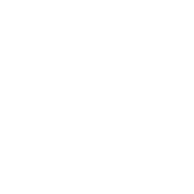

  
  <h1>BiteLog</h1>
  
<strong>Effective way to track your eating habits</strong>

## About

BiteLog is a food diary app that helps users maintain a healthy lifestyle by tracking their eating habits. It provides personalized recommendations based on age, gender, height, and weight to guide users on daily calorie and nutrient intake.

BiteLog's calorie intake visualization tool presents a color-coded graph of daily and weekly calorie intake with macronutrient breakdown. This helps users make informed decisions about food choices and stay on track towards their health goals.

Whether users want to lose weight, maintain a healthy diet, or keep track of eating habits, BiteLog is the perfect companion to support their journey towards a healthier lifestyle.

## Contributing

See the [contributing](Contributing.md) guide for detailed instructions on how to get started with this project.

## License

The project is made available under the MIT license. See the [license](License.md) file for more information.
